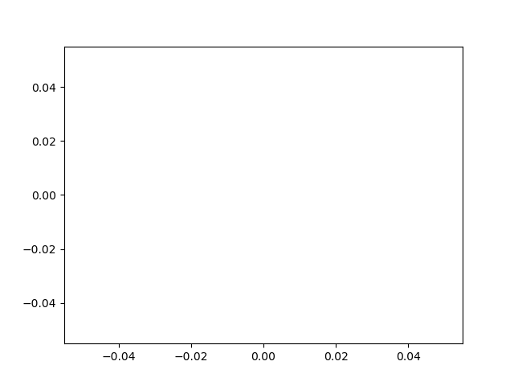

---
---
# Simple Python Plotting

```python
import numpy as np
import matplotlib.pyplot as plt

plt.plot([])
plt.savefig("test.png")
plt.show()
```

$$\begin{gather}
    2 + 2 \\
    3 +3 \\
\end{gather}
$$




